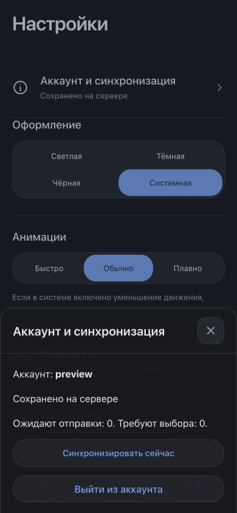

# Агент и синхронизация: отчёт для объединения

1 октября 2026. Ветка `codex/agent-sync`, основа `c218703` из `codex/rebuild`.
Версия приложения и package-lock: **1.24.0**. Изменения не объединены с другими
ветками и не опубликованы на GitHub Pages. VPS владелец арендует позже.

## Что реализовано

Настройки аккаунта подключают личные задания и заметки к небольшому Python/SQLite
серверу. Первый вход отправляет прежние локальные задания; чистое устройство получает
серверные записи. Офлайн-правки остаются в очереди и отправляются при восстановлении
связи/открытии приложения. Повторы безопасны, удаления сохраняются как отметки,
конфликты показывают обе версии и требуют выбора. Оформление и свёрнутые группы
остаются локальными, расписание — прежним встроенным источником сроков.

Микрофон доступен после входа в аккаунт. Запись → Parakeet v3 INT8 на CPU → текст →
существующий Claude Haiku → карточки. После остановки записи разбор начинается
автоматически. Автоматическое сохранение включается отдельной настройкой, по умолчанию
выключено; при неоднозначном предмете/сроке нужен выбор. Добавление можно отменить
в течение 15 секунд. Две подходящие лабораторные одного дня не получают молча
привязку к первой паре. Дедлайны вычисляет клиент, сохранённая дата не пересчитывается.

Сервер слушает loopback `4286`, интерфейс проверялся отдельно на `4185`.
Локальный Mac-пилот `4175/4176` и его контракт сохранены. Claude не получает
инструменты или доступ к базе. Подготовлены конфигурации HTTPS/Caddy и systemd,
но они ещё не установлены на VPS.

## Совместимые миграции

1. **Notebook v1 / `dz-next:v1`:** необязательные `sync` и `autoAdd`. Старые записи
   читаются без перезаписи при загрузке; ID, даты, темы и локальные настройки сохранены.
   Задания и очередь изменений записываются одним JSON. Обнаруженный устаревший
   снимок другой вкладки не перезаписывается; вкладки подхватывают события `storage`.
2. **Первая привязка:** исходная копия в `dz-next:before-account:v1`; далее очередь
   прежних ID. Смена аккаунта архивирует текущую книжку в отдельном ключе аккаунта,
   возврат восстанавливает её задания/очередь. Сессия в `dz-next:session:v1` отделена
   от Notebook и не попадает в экспорт. Это новые ключи, очистки старых нет.
3. **Импорт JSON:** добавляет задания без замены текущей книжки, не переносит чужую
   привязку аккаунта; разные записи с одинаковым ID получают новый ID. Повторный
   импорт одинакового содержания не создаёт дублей. Перед импортом сохраняется
   локальная копия текущего Notebook.
4. **SQLite:** новая серверная схема `PRAGMA user_version=1` в `server/store.py`:
   `users`, `sessions`, `tasks`, `operations`, индекс ревизий. Инициализация повторяема;
   более новая схема отклоняется. Прежней серверной базы в проекте не было.
   Резервное копирование использует SQLite backup API, включая данные WAL.

Демо не использует рабочее хранилище или аккаунт. Ключи legacy `dz:*` не затронуты.
При откате клиента сначала выгрузить JSON и отключить облачную функцию; старый
клиент не поддерживает очередь синхронизации. При откате базы курсор устройства,
опережающий сервер, даёт ошибку и требует сверки копий, а не молчаливого сброса.

## Проверки

- **58/58 клиентских тестов** — команда из `test:next`, выполненная напрямую Node 24:
  `node --experimental-strip-types --test tests/*.test.mjs`.
- **10/10 серверных тестов:** `python3 -B -m unittest discover -s server -p 'test_*.py' -v`.
  Реальные временные SQLite и HTTP: авторизация/отзыв/срок сессий, CORS, изоляция
  пользователей, повтор операции, конфликт, удаление, атомарный отказ плохого пакета,
  лимит входа, backup и повторное открытие схемы.
- **TypeScript и production-сборка:** команды из `build:design` выполнены напрямую
  установленными `tsc` и `vite`, без изменения зависимостей. Версия shell — 1.24.0.
- **Браузер, реальные аккаунты/SQLite:** отдельные origin `127.0.0.1` и `localhost`
  дали независимые localStorage. Прежняя импортированная запись появилась во второй
  копии, отметка выполнения перешла в историю. При остановленном API ручное задание
  пережило перезагрузку, осталось в очереди и дошло до второй копии после запуска API.
  Выход из аккаунта сохранил задания. Соседняя вкладка того же origin подхватила правку.
  Демо показало отключённую синхронизацию.
- **Настоящий Claude:** вход Pro доступен на текущем Mac; `haiku` через `claude -p`
  вернул «Э-104, страница 115, номера 35, 36, 38» и срок `days=1`. Проверено также
  из приложения: карточка, сохранение, закрытие окна, отмена добавления. Отдельный
  однозначный пример добавился в автоматическом режиме.
- **Настоящая Parakeet / CPU:** sherpa-onnx 1.13.6, INT8 v3, 2 потока, Mac ARM64.
  Синтетическая русская фраза: первый вызов 2,03 с, повтор 0,46 с, peak RSS около
  1190 МиБ. Через настоящий авторизованный HTTP-маршрут MP4 — 2,13 с, WebM — 0,43 с.
  Это проверка форматов/запуска, а не точности реального микрофона или скорости VPS.
  **ASR потеряла букву Э и исказила некоторые номера.** Поэтому проверка текста
  важна даже при отсутствии вопроса от Claude; автоматический режим по умолчанию выключен.
- **Интерфейс:** проверены фактические ширины 390 и 1280 px, карточки и настройки.
  Попытка других размеров через браузерный инструмент не изменила фактическую ширину;
  320/375/430 px этой проверкой не подтверждены. Физический iPhone не проверялся.
- **Собранное приложение через `vite preview`:** версия 1.24.0, сохранённая сессия,
  отметка выполнения и история прошли, в проверенной вкладке нет ошибок/предупреждений
  консоли. Во время изменения исходников dev-сервер показывал ошибки горячей
  перезагрузки React; этот сценарий не выдаётся за ошибку проверенного production-прогона.

Первый браузерный стенд возвращал фиксированный ответ агента; затем его заменили
на настоящий сервер и отдельно проверили модели. Эти результаты не смешиваются.
Тестовые базы, аудио, модель и окружение находятся вне Git; личные задания владельца
не использовались. Проверочные процессы остановлены после завершения.

## Изменённые файлы

| Файлы | Назначение |
| --- | --- |
| `design/main.tsx` | Подключение аккаунта, микрофона, атомарного сохранения, отмены и импорта |
| `design/storage.ts` | Совместимые поля, очередь вместе с данными, чтение других вкладок, безопасный импорт |
| `design/sync-model.ts` | Ревизии, операции, разбор ответа, конфликты, отметки удаления |
| `design/use-cloud.ts` | Сессия, привязка/смена аккаунта, очередь и запросы API |
| `design/account-panel.tsx` | Вход, состояние синхронизации и выбор версии конфликта |
| `design/smart-input-panel.tsx`, `design/smart-input.ts` | Серверный разбор, запись, уточнения, автоматическое добавление, выбор пары |
| `design/style.css` | Размер микрофона, формы аккаунта и кнопка отмены набора |
| `server/app.py`, `server/store.py` | HTTP-сервис, аккаунты, сессии, SQLite и синхронизация |
| `server/asr.py`, `server/download_model.py`, `server/requirements.txt` | CPU Parakeet, загрузка весов и изолированные зависимости |
| `server/dz.service`, `server/dz.env.example`, `server/Caddyfile.example` | Примеры конфигурации VPS, без секретов |
| `server/README.md` | Запуск, протокол, миграции, резервные копии и развёртывание |
| `server/test_server.py`, `tests/sync.test.mjs`, `tests/smart-input.test.mjs` | Затронутые сценарии |
| `vite.design.config.ts` | Отдельные порты/API proxy и собственный кеш Vite |
| `package.json`, `package-lock.json` | Версия 1.24.0, клиентских зависимостей не добавлено |
| `.gitignore` | Исключение Python-кешей |
| `docs/AGENT_SYNC_PLAN.md`, `docs/AGENT_SYNC_REPORT.md`, `docs/agent-sync/account-mobile.png` | План, отчёт и снимок тестового аккаунта |

## Объединение с аудитом и следующий этап

Главные места возможных конфликтов: `design/main.tsx`, `design/storage.ts`,
`design/smart-input-panel.tsx`, `design/style.css`, версии package/lock. Переносить
изменения в выбранную ветку только после согласования с владельцем. После объединения
повторить клиентские/серверные проверки, сборку и старую книжку `dz-next:v1`;
не заменять новую очередь прежней записью из `useEffect`.

Workflow `.github/workflows/deploy.yml` не изменён: push в `codex/agent-sync` не
входит в его список веток. `main`, `codex/rebuild`, рабочая папка аудита не объединяются.
Push этой ветки сохраняет результат для review и не публикует приложение.

После аренды: Linux x86-64, стартовый кандидат 2 vCPU / 4 ГБ RAM / 30–50 ГБ SSD,
возможность увеличить ресурсы. Нужны SSH-адрес и доступный ключ-файл, HTTPS-домен,
отдельный вход Claude от пользователя сервиса. Затем установить конфигурацию,
проверить реальные задержки/память, резервные копии вне VPS, CORS и микрофон Safari/PWA
на физическом iPhone. Linux, systemd, DNS/HTTPS и производительность выбранного VPS
пока не приняты. Публикация клиента — отдельное поручение.

