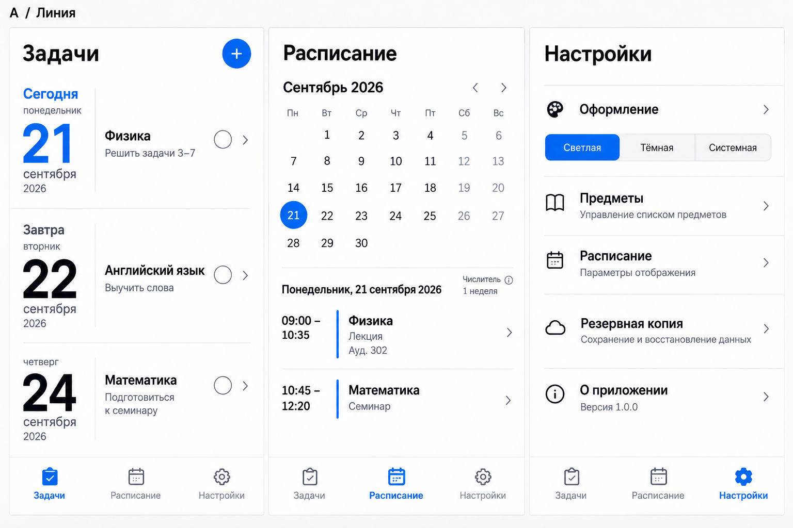
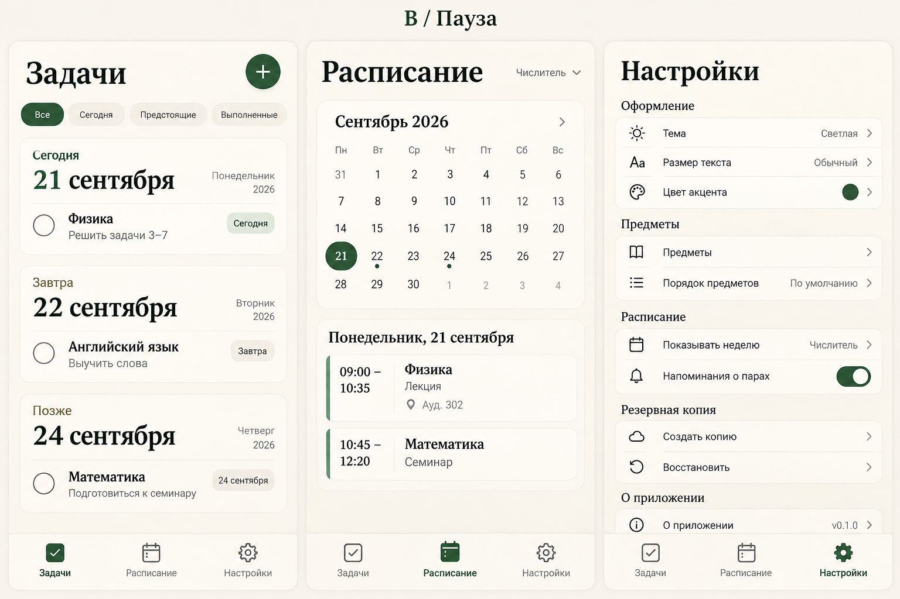
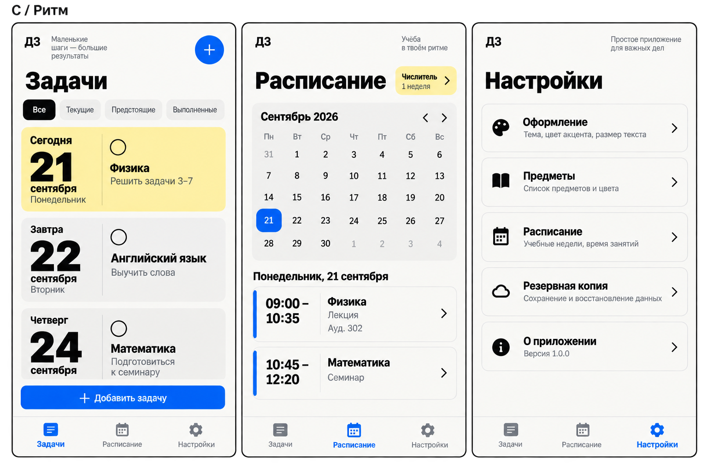

# Концепции ImageGen — первая подборка

Сгенерированы 19 сентября 2026 встроенным ImageGen. Выбор владельца ожидается. Это визуальные концепции, не снимки работающего приложения.

## A — «Линия»

Строгий список, отдельная колонка крупных дат, минимум контейнеров.

## B — «Пауза»

Тёплый фон, зелёный акцент и свободные блоки дней. Самое спокойное направление.

## C — «Ритм»

Крупная типографика, контрастные блоки, явный акцент на сегодняшних задачах.

## Результат просмотра

Все три изображения содержат основные вкладки, крупные сроки и календарь. По удобству основа A выглядит перспективно: даты отделены от названий, меньше визуальных контейнеров. B предлагает более мягкий характер; C лучше выделяет сегодняшний день.

Перед вёрсткой нужно уточнить плотность на нескольких заданиях одного дня. В A нужно убрать ошибочную подпись «1 неделя» рядом с числителем; в B генератор добавил напоминания и дополнительные настройки, а в C — слоганы и две кнопки добавления. Эти детали не расширяют согласованный объём приложения. Версии на картинках демонстрационные. Календарные вычисления и фактическая адаптивность проверяются в коде, а не по картинке.

Следующий шаг — обратная связь владельца и, при необходимости, около пяти ImageGen-вариаций выбранного направления. Затем фиксируем итоговые референсы и приступаем к вёрстке. Точные исходные промпты: [PROMPTS.md](PROMPTS.md).
