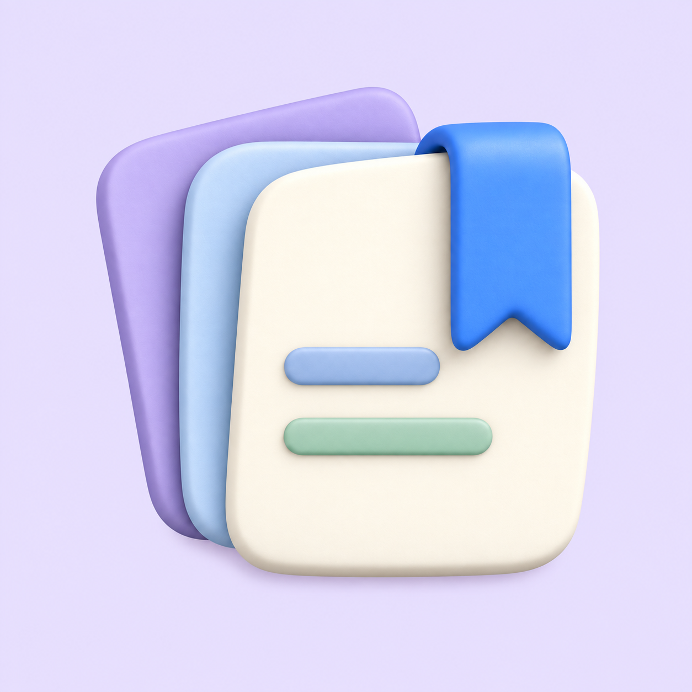

# Развитие выбранной «Стопки»

Встроенный ImageGen, исходник — `../03-stack.png`. Только объёмные бумажки с синей закладкой. Владелец выбрал A; установлен как рабочая иконка в 1.23.45.

Основные варианты для выбора: A (ближе к исходнику), C (холоднее, меньше деталей), D (раскрытый веер, закладка слева). B слишком близок к A.

## Стопка D — раскрытая

Создана заново по описанию выбранного стиля, без прикреплённого изображения.

Промпт:

Create a finished opaque square iPhone app icon: a friendly soft 3D clay sculpture of exactly THREE separate thick ivory paper task cards spread in a clearly visible FAN. Center front card upright, back left card rotated counterclockwise by 25 degrees and back right card rotated clockwise by 25 degrees; both back cards visibly project to left and right, balanced symmetrical fan silhouette, not a near-aligned stack. A thick pillowy cobalt-blue ribbon bookmark folds over the TOP LEFT edge of the front card and hangs down with a V-cut end. On the lower half of the front card are three rows of rounded shallow embossed task lines in muted lavender, mint and apricot. Back cards pale apricot and lavender with no markings. Paper cards have very rounded pillowy corners, soft dimensional thickness, beautifully shaded ivory surface, tactile satin clay material, diffuse studio illumination and gentle contact shadows. Square pale lavender full-bleed background, fully OPAQUE all the way to every edge, NOT TRANSPARENT. Object occupies about 70 percent of frame with safe margins. Clean playful premium student homework planner home screen icon. NO text, no letters, no numbers, no DZ, no phone mockup, no grid, no labyrinth or path, no abstract logo. Render one single icon.

## Стопка A — аккуратная

Промпт:

Edit the attached liked reference into ONE closely related student-planner app icon variation. It MUST remain a soft volumetric stack of three paper cards with a blue bookmark, like the reference. Three thick softly rounded paper cards almost aligned, ivory front card, pale peach middle card, pale lavender back card. A rich blue wide bookmark drapes over the upper right edge of the front sheet. Three rounded raised pastel horizontal task lines on the front. Very close to the reference, slightly tidier composition. Preserve the same friendly tactile clay-like 3D material, rounded edges, soft studio lighting and shadows as reference. Centered emblem at about 70% of square canvas. Fully opaque solid very pale lavender background edge-to-edge, no transparency. No text, letters, numbers, DZ, logos, abstract routes, paths, mazes, orbits, suns or books. Do not make a phone mockup or comparison grid. One square image only.

## Стопка B — веером

Вариант оказался слишком близким к A; не считать отдельным направлением.

Промпт:

Edit the attached liked reference into ONE closely related student-planner app icon variation. It MUST remain a soft volumetric stack of three paper cards with a blue bookmark, like the reference. Exactly three thick rounded paper cards fanned out slightly, ivory front card tilted a little clockwise, pale peach and lavender cards peeking behind at opposing angles. One broad soft blue bookmark hangs over the upper right of the front sheet. Three rounded pastel raised task lines. Playful but simple, strong dimensional softness. Preserve the same friendly tactile clay-like 3D material, rounded edges, soft studio lighting and shadows as reference. Centered emblem at about 70% of square canvas. Fully opaque solid very pale lavender background edge-to-edge, no transparency. No text, letters, numbers, DZ, logos, abstract routes, paths, mazes, orbits, suns or books. Do not make a phone mockup or comparison grid. One square image only.

## Стопка C — спокойная

Промпт:

Edit the attached liked reference into ONE closely related student-planner app icon variation. It MUST remain a soft volumetric stack of three paper cards with a blue bookmark, like the reference. Exactly three thick soft rounded paper cards in a compact orderly stack with lower and left edges clearly visible, warm ivory front card, cool pale blue middle, muted lavender back. One broad cobalt-blue bookmark folded over the upper right edge. Two short raised pastel rounded horizontal task lines on front. More restrained colors, generous clean shapes. Preserve the same friendly tactile clay-like 3D material, rounded edges, soft studio lighting and shadows as reference. Centered emblem at about 70% of square canvas. Fully opaque solid very pale lavender background edge-to-edge, no transparency. No text, letters, numbers, DZ, logos, abstract routes, paths, mazes, orbits, suns or books. Do not make a phone mockup or comparison grid. One square image only.

