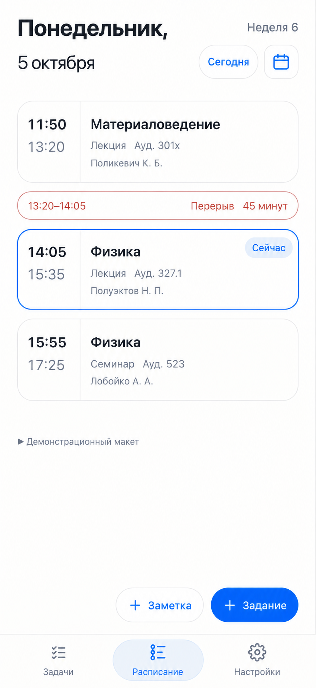
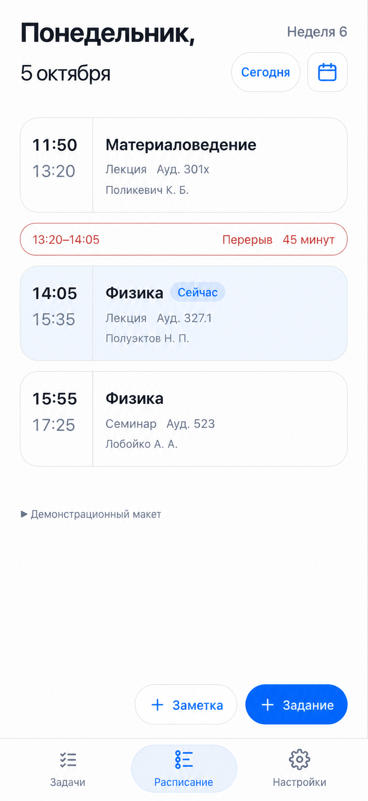
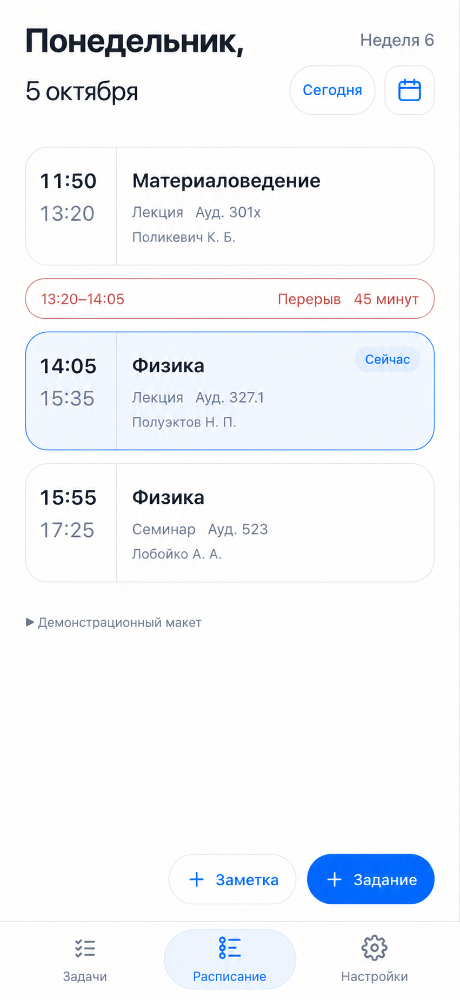
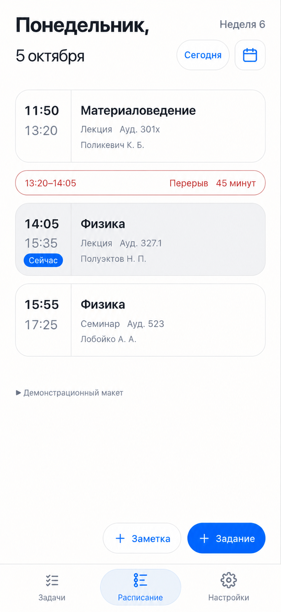
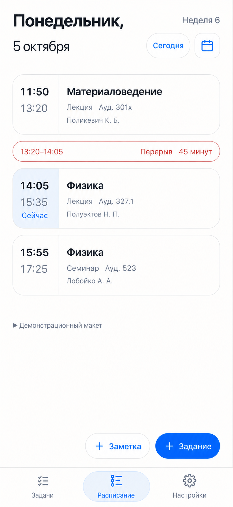
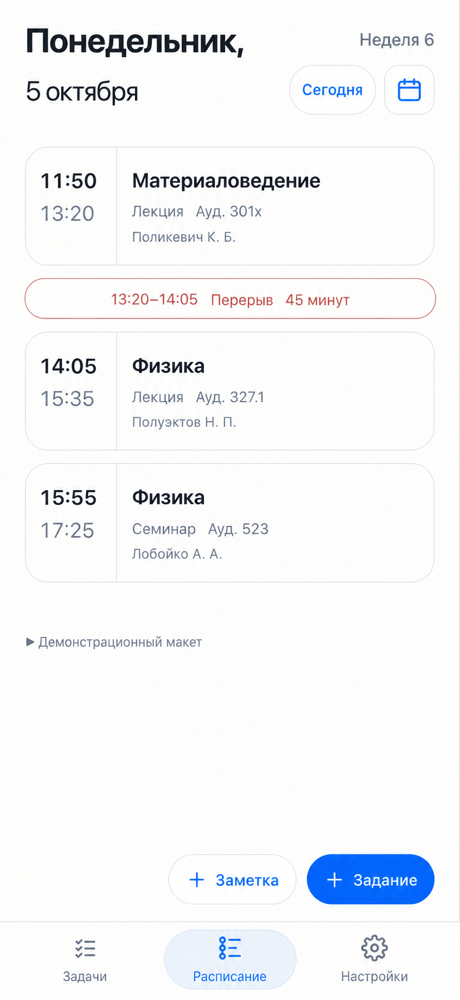
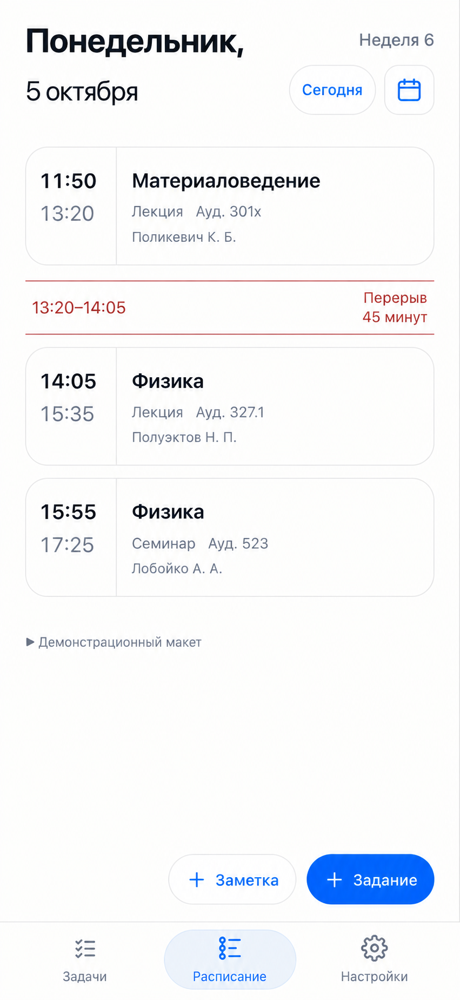
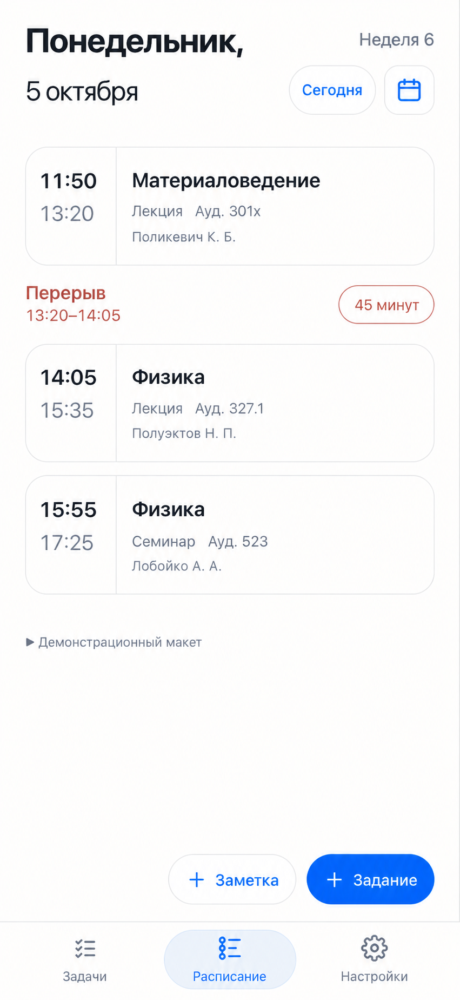
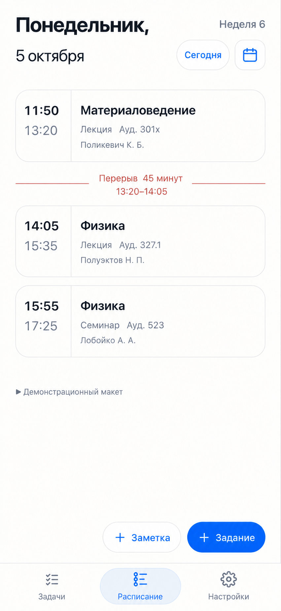

# N4a — варианты для выбора

27.09.2026. Созданы встроенным ImageGen; это макеты, не изменения рабочего интерфейса. [Точные промпты](prompts.json), [исходный снимок](reference.png).

Одинаковое расписание на 5 октября 2026. Для подсветки принято демонстрационное время 14:30: текущая пара — физика 14:05–15:35. Выбор подсветки (1–5) и оформления перерыва (A–D) независимы. До выбора владельца не внедрять. При реализации CSS сохранить настоящую геометрию и текст, включая размеры времени; небольшие отклонения генерации не являются требованиями.

## 1. Контур

Синяя рамка и небольшая метка, фон карточки прежний.

## 2. Мягкая заливка

Светло-синий фон, серый контур, метка рядом с предметом.

## 3. Контур и заливка

Тонкая рамка и едва заметный фон; рекомендуемый вариант.

## 4. Метка у времени

Нейтральная заливка и синяя капсула под временем.

## 5. Только время

Подсвечивается только левая колонка.

## A. Общая капсула

Все сведения по центру одной строки.

## B. Два края

Интервал слева, название и длительность справа между тонкими линиями.

## C. Капсула длительности

Название и интервал слева, отдельные 45 минут справа.

## D. Центральный разделитель

Две строки по центру, короткие линии по сторонам.

