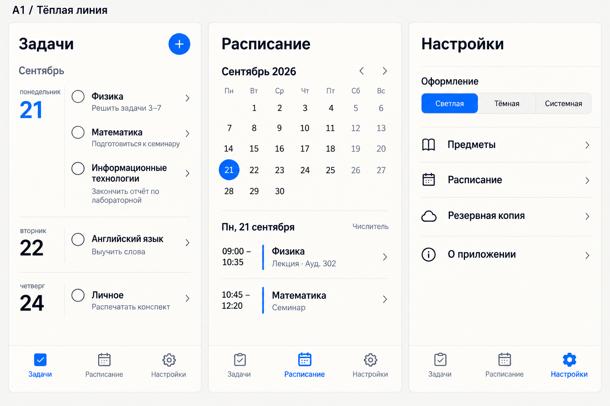
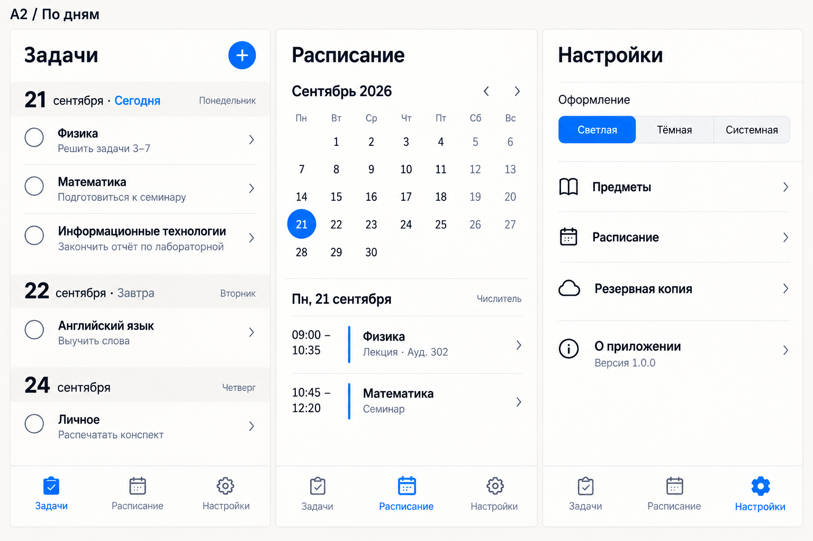
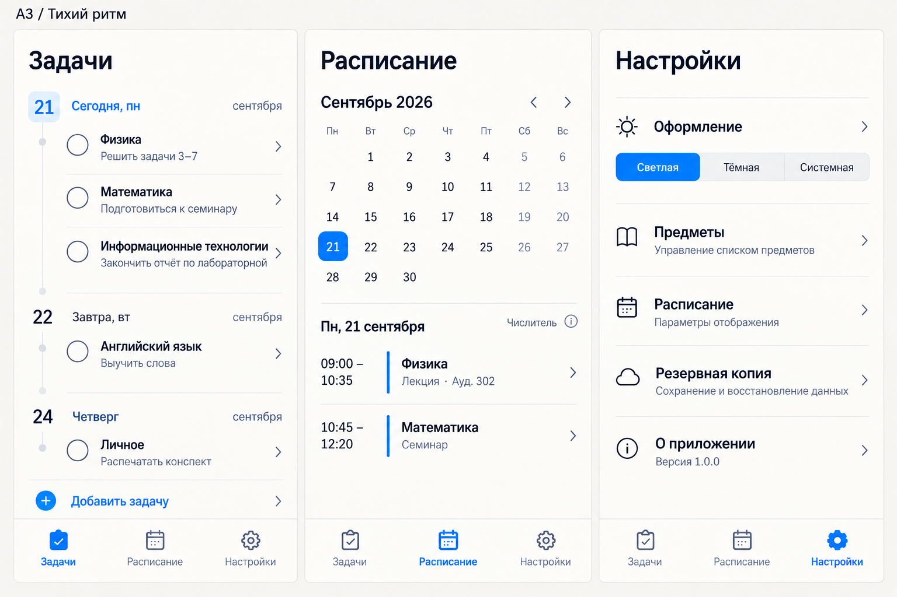
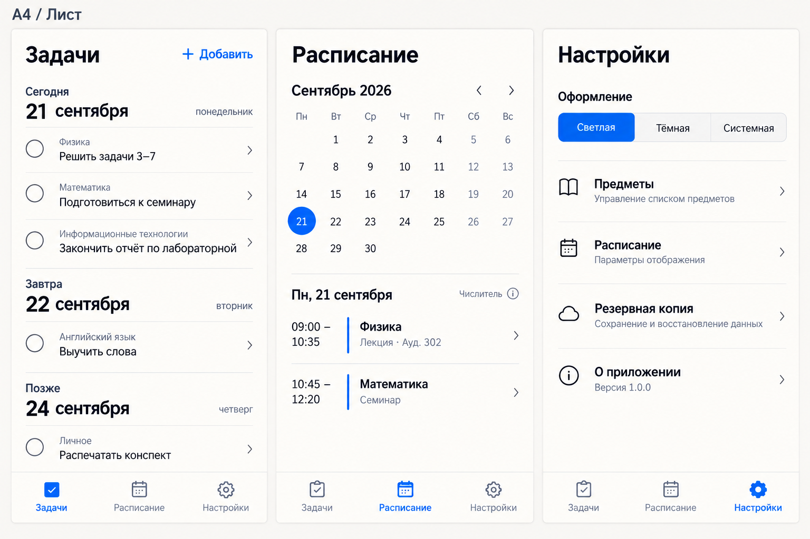
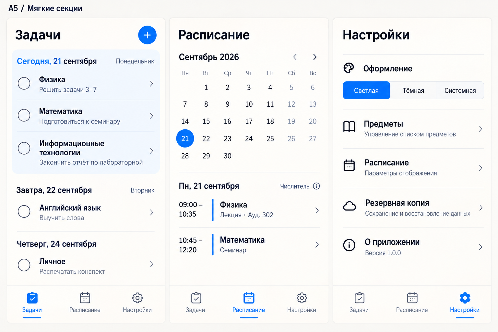

# Вторая подборка: развитие «Линии»

19 сентября 2026. Встроенный ImageGen; пять отдельных генераций с A и B в качестве референсов. Ориентир владельца: 80% ясности A + 20% мягкости B, без формальности и тяжёлой типографики. Владелец выбрал A4 «Лист» и поручил реализацию. Кликабельная вёрстка — `design/`, отчёт — `docs/design/implementation/README.md`.

На всех макетах одинаковое содержимое: три задания сегодня, одно завтра и одно позже. Это позволяет сравнить размещение дат и длинных названий. Изображения задают внешний вид; они не подтверждают работу календаря или адаптивности.

## A1 — Тёплая линия

Ближе всего к первому: узкая колонка дат, несколько задач на день, чуть мягче фон и разделители.

## A2 — По дням

Дата над списком: больше места для текста и длинных предметов.

## A3 — Тихий ритм

Более компактный список с тонкой вертикальной линией между днями.

## A4 — Лист

Почти как аккуратная заметка: минимум рамок и спокойная типографика.

## A5 — Мягкие секции

Чуть больше мягкости второго варианта, но без книжных шрифтов и вложенных карточек.

Точные промпты и роли референсов: [PROMPTS.md](PROMPTS.md). Следующий шаг — выбор варианта или конкретных деталей владельцем, затем уточнение состояний перед вёрсткой.

Просмотрены все пять изображений: три вкладки и пять заданий сохранены. A1 ближе всего к исходному выбору, A2 даёт длинным названиям больше ширины, A4 делает основным сам текст задания и выглядит наиболее спокойно. Рекомендация для дальнейшего обсуждения: сравнить A1 и A4, при желании объединить даты первого с иерархией текста второго.

Небольшие расхождения генерации с промптом: A1 сохранил вертикальные разделители, A3 повторяет месяц в нескольких группах, у части вариантов добавлены пояснения к настройкам и демонстрационная версия 1.0.0. Это детали картинки, не решения по функциям или фактической версии приложения. Контраст мелких подписей и переносы на реальных 375 px ещё предстоит проверить при вёрстке.
