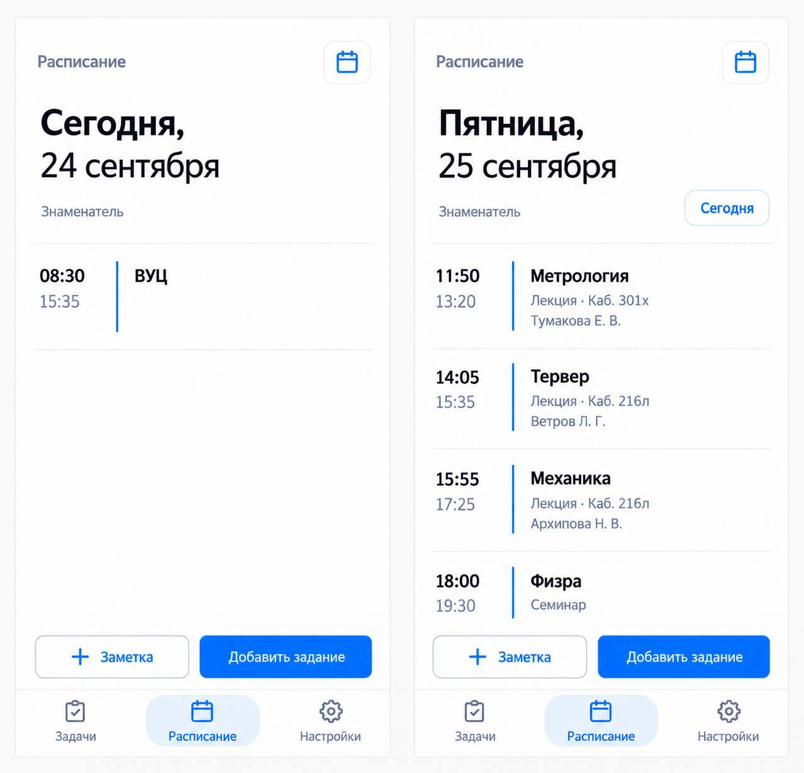
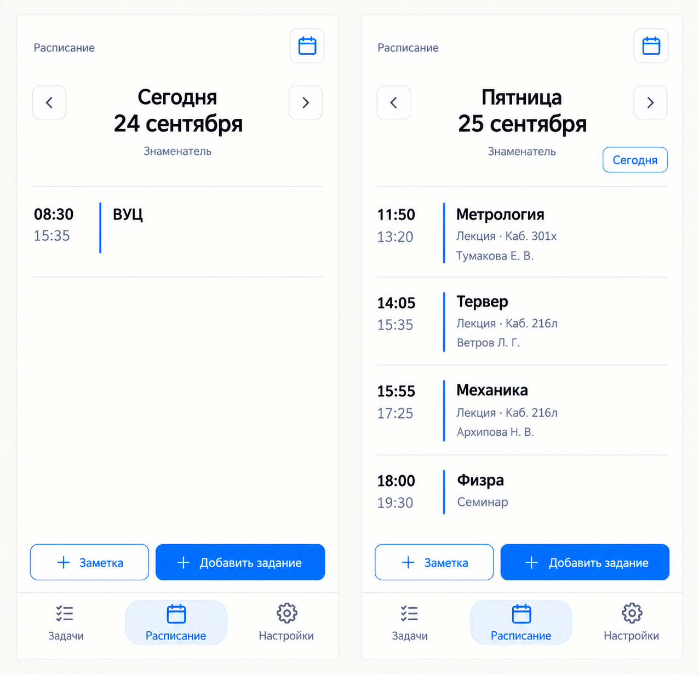
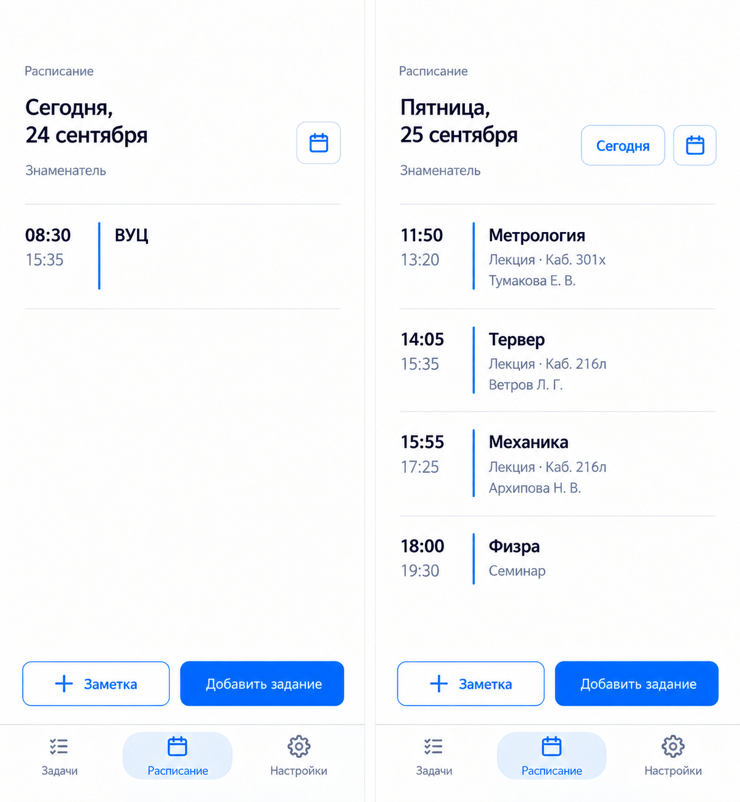

# R1 — варианты шапки расписания

Подготовлено 24 сентября 2026 встроенным ImageGen. Статус: три концепции готовы, ожидается выбор владельца. Код приложения и версия 1.23.15 не менялись.

Каждое изображение показывает сегодняшний день (24 сентября, ВУЦ) слева и другой день (25 сентября, четыре пары) справа. Расписание взято из src/data/schedule.ts, неделя — знаменатель. Это растровые концепции композиции, не готовая вёрстка и не проверка на iPhone. Карточки и навигацию при реализации сохраняем из приложения; мелкие различия шрифтов и иконок генератора не являются требованием.

## A — День главный

Крупный день и дата слева, календарь в верхней строке. Без стрелок; возврат на сегодня в служебной строке только у другой даты.

## B — Симметричные кнопки

День и дата по центру между одинаковыми кнопками предыдущего/следующего дня. Календарь в верхней строке.

## C — Компактная дата

Сдержанный размер заголовка, календарь рядом с датой; на другом дне рядом появляется возврат на сегодня.

## Генерация и проверка

Исходные референсы: снимок текущего приложения .cache.local/d5-webkit-light.png и docs/design/concepts/round-2/a4.png (только стиль). Точные начальные промпты — в трёх *.prompt.txt; refinement.prompt.txt применён отдельно к каждому первому результату. Уточнение уменьшило название раздела и убрало выдуманные сведения о ВУЦ. Итоговые изображения просмотрены: оба состояния, отсутствие лишней кнопки «Сегодня» на текущей дате, одинаковое начало списка между состояниями, реальные пары и различия композиций. Финальные PNG сохранены без обработки. Рекомендация: A для выразительного заголовка, C для более компактного экрана. Выбор не сделан.
