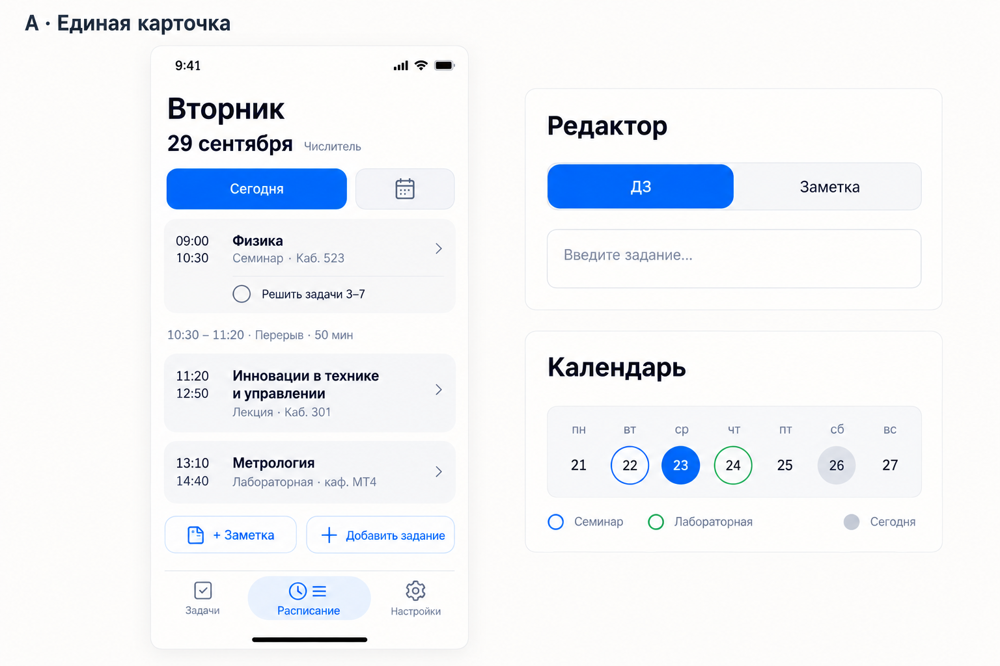
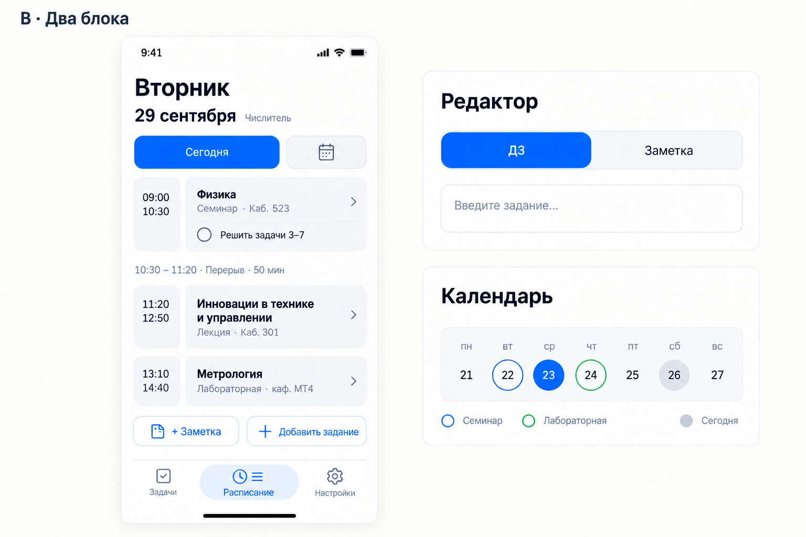
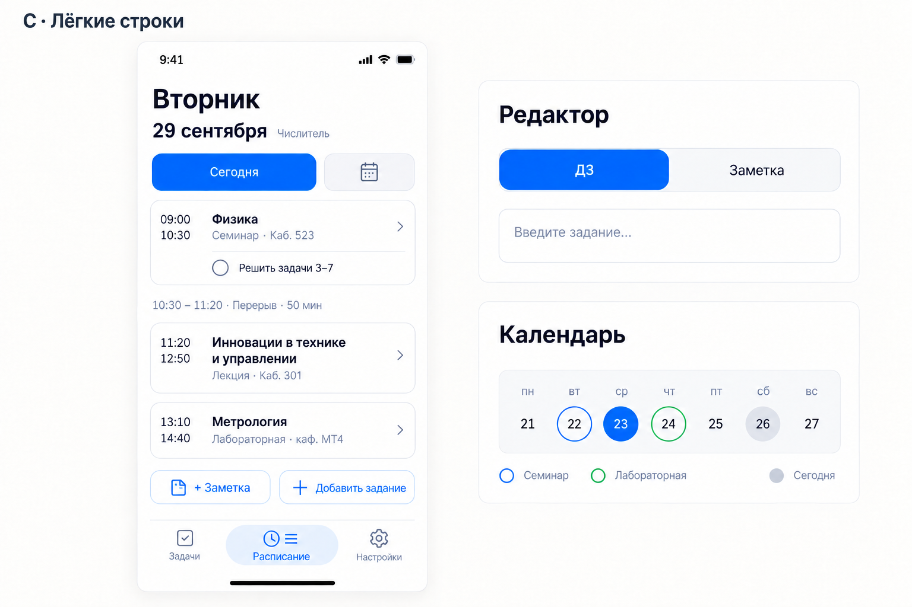

# U2 — карточки расписания

27 сентября 2026. Три варианта на одинаковых условных данных, встроенный ImageGen. **Все три отклонены владельцем.** Оставлены только для истории. Вместо них — точечные изменения текущего «Листа» по уточнению в UI_POLISH_PLAN.md; новая палитра отложена.

## A — единая карточка

Время и предмет внутри одного мягко скруглённого блока. Самый спокойный баланс читаемости и плотности.

## B — два блока

Отдельный узкий блок времени и широкий блок предмета. Сильнее обозначает структуру пары, но создаёт больше границ.

## C — лёгкие строки

Почти без заливки, с тонким скруглённым контуром. Ближе всего к текущему «Листу».

Справа на каждом изображении — отдельные образцы переключателя и календарных отметок, не элементы основного экрана расписания. Календарь остаётся по кнопке. Изображения служат выбору композиции: в приложении всё реализуется CSS/DOM/SVG. Размеры кнопок и переносы проверяются на реальной вёрстке, не по растру; два вида занятия в одну дату потребуют сегментов кольца. Сегодня, выбранный срок и занятие должны иметь различимые сочетания.

Промпты: [A](a-prompt.txt), [B](b-prompt.txt), [C](c-prompt.txt). A создан по стилевому образцу `../round-2/a4.png`; B и C — правки изображения A с сохранением остальных элементов.

## Ограничение U1

Выпуск 1.23.23 (`69928c0`) согласует фон документа/оболочки и `theme-color`. В Safari Simulator темы переключаются корректно. В standalone после редактора и возврата из Safari осталась серая системная полоса; исправление системной области не подтверждено. Это наблюдение, не доказательство конкретной причины WebKit. Геометрия рабочей оболочки не менялась.

Для дальнейшей диагностики: [пояснение разработчика WebKit о цвете закреплённых элементов](https://bugs.webkit.org/show_bug.cgi?id=301756#c2), [сообщения о системной области Home Screen web apps](https://bugs.webkit.org/show_bug.cgi?id=301994). Наличие похожих сообщений не подтверждает тождество причин.
