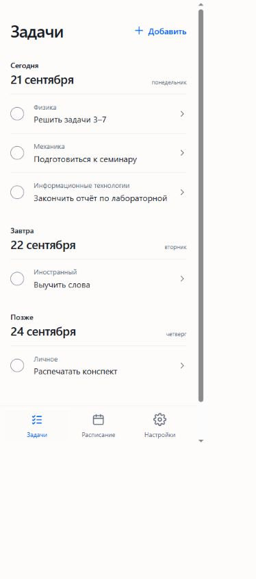
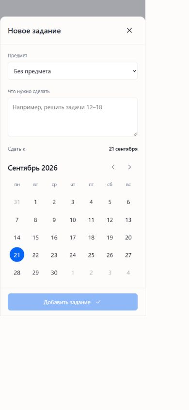
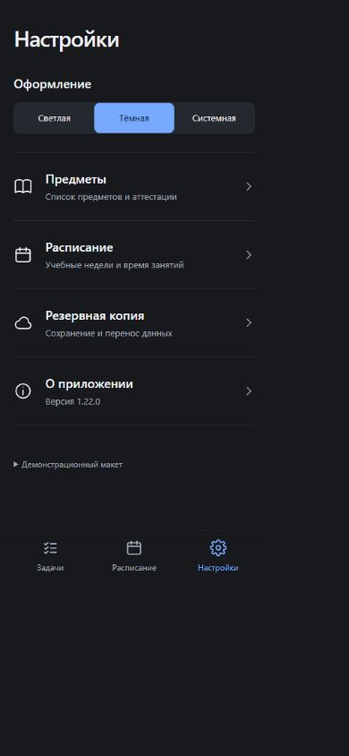
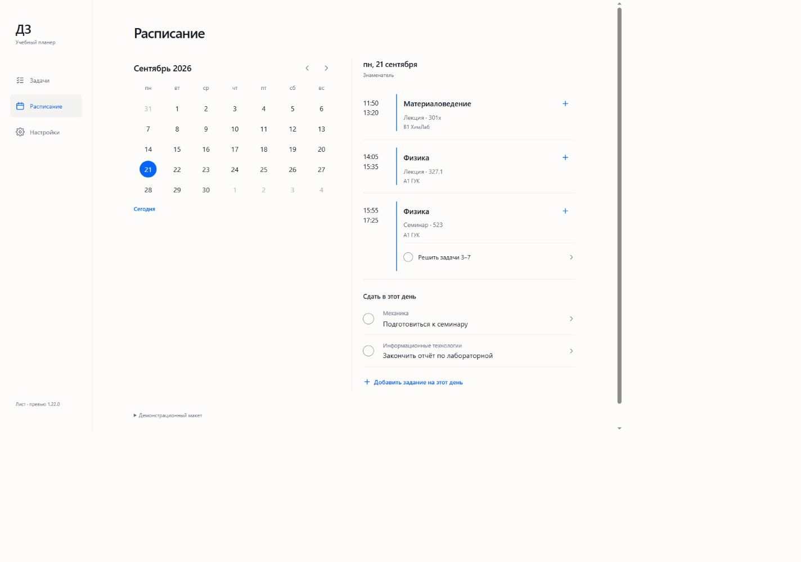

# Реализация A4 «Лист» — 1.22.0

Владелец выбрал A4 из второй подборки. Реализована кликабельная вёрстка на демоданных. Основной текст заданий контрастный, предмет второстепенный, даты над группами, тонкие разделители, синий акцент. Системные шрифты, иконки SVG; растровые ассеты для этого интерфейса не нужны.

## Проверено

- `npm run build:design` и `npm run build` проходят.
- В браузере: 390×844, 375×812 и 1440×1000; горизонтального переполнения не обнаружено. Диалог с длинным текстом, список, настройки и настольное расписание просмотрены визуально. Мобильные кнопки рассчитаны на область нажатия от 44 px.
- Добавление на выбранную дату, редактирование, выполнение, возврат, удаление и отмена удаления.
- Сворачивание дня, длинные названия и записи, просрочка, выполненные, пустой список и задача без предмета.
- Календарь, длинный блок ВУЦ, выходной без пар, лекция и семинар одного предмета: существующее задание привязано к семинару.
- Переключение светлой/тёмной темы, диалог предметов. Ошибок и предупреждений в консоли браузера не обнаружено.

Это проверки в Chromium, не на физическом iPhone. Снимки браузера на Windows включают свободную область из-за масштабирования отображения; CSS-ширины проверены отдельно по DOM.

## Границы этапа

Изменения только в памяти. Постоянное хранение, редактирование расписания и предметов, резервные копии, перенос прежних данных, PWA и публикация — следующие этапы. В макете пункт резервной копии объясняет это прямо. Реальный календарь и расписание отличаются от условных дат/предметов на изображении: 21 сентября 2026 — знаменатель по якорю проекта.

## Снимки

Задачи, светлая тема:

Редактор:

Настройки, тёмная тема:

Расписание на компьютере:

