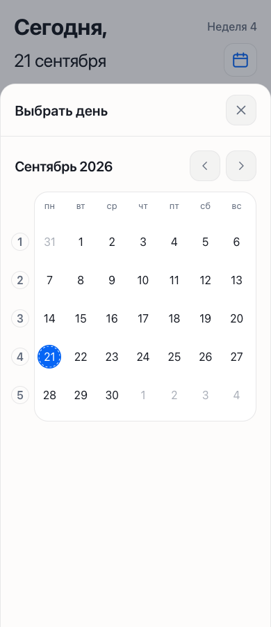

# Проверка 1.23.53

27 сентября 2026. Ветка `codex/rebuild`.

## Причина сбоя анимаций

На готовой сборке `getComputedStyle(...).getPropertyValue('--motion-height')` возвращал `.32s`. Старый `parseFloat` передавал в Web Animations 0,32 мс вместо 320 мс. Покадровая проверка месяца показывала только начальную/конечную матрицы, без промежуточного движения. В dev исходные `320ms` маскировали ошибку. Исправлено преобразование секунд и миллисекунд; тест проверяет реальные варианты минификации.

## Изменения

- Календарь: реальные строки Grid без `display: contents`; естественная высота сохраняется. Нельзя анимировать скрытый календарь с нулевой шириной после выбора предмета.
- Сегментированные переключатели: общий обработчик затемнения кнопок больше не накладывает неподвижное пятно на движущуюся подложку.
- Верхняя полоса: возвращён точечный обход из `8bccf8a`, без отката интерфейса. Владелец явно выбрал «Вернуть обход с перезагрузкой». Сначала синхронно сохраняется весь блок данных, затем `location.replace` открывает настройки. Все темы сохранены. При офлайне, ошибке записи, заблокированном хранилище и в демо перезагрузки нет.
- Иконка, данные, расписание и принятые анимации не заменены.

## Проверки и ограничения

Сборка TypeScript/Vite и 40 тестов логики прошли. Проверки UI выполняются на `vite preview` готового `dist-design`, а не на dev-сервере. Chromium/WebKit: первое и повторное открытие календаря, промежуточные кадры месяца, «Текущий месяц» без закрытия, редактор после выбора предмета; ширины 320/390/430/1440. Проверены прежние сценарии окна, нажатия пары, «Сегодня», темы и reduced motion.

Отдельно Chromium/WebKit с изолированным хранилищем: ручное переключение темы в standalone вызывает навигацию после записи и возвращает настройки; контрольное задание не теряется. Обычный браузер, demo, offline, ошибка записи и повреждённые исходные данные не перезагружаются. Это имитация standalone для проверки логики, не проверка системной полосы.

Device Hub, iPhone 17/iOS 27: до изменения сетка 1.23.52 открылась сразу без стрелок; повторение последнего сбоя владельца не подтверждено. После перезапуска симулятора запущена локальная установленная копия, но управление снова многократно возвращало `noWindowsAvailable`/`AXError.cannotComplete`. Переключение темы и окончательный вид полосы в новой сборке на iOS подтвердить не удалось. На физическом iPhone проверки не было. Автоматическая смена системной темы без ручного выбора не вызывает reload; этот обход относится к ручному переключателю.

Личные файлы не включены в коммит. Дата начала второго семестра по-прежнему не подтверждена.

Снимок готовой сборки в браузерном WebKit (не iOS Simulator):

