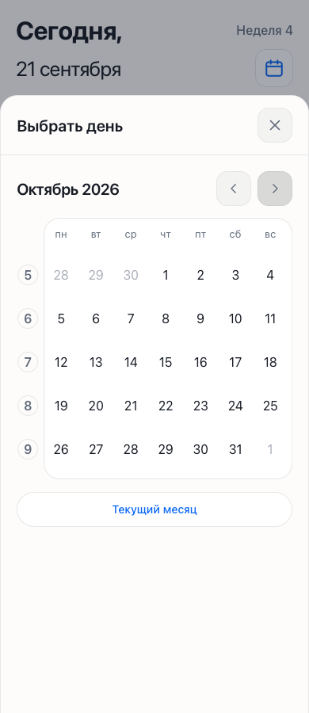
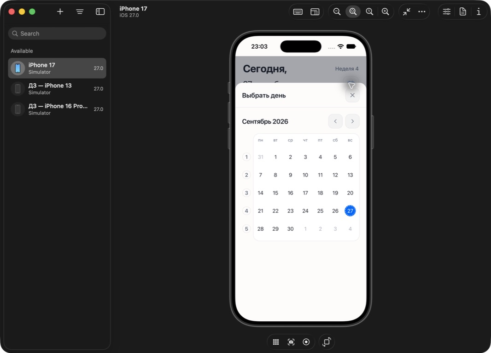
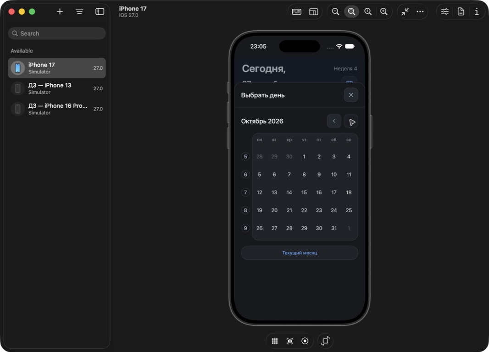

# Проверки 1.23.55

## Изменения

Отрицательный margin-left −5 px обрезал кружки номеров недель после сужения viewport в 1.23.54. Теперь margin-left 1 px, ширина колонки 34 px: весь круг и зазор до рамки помещаются внутри календаря.

Прежняя анимация двигала всю ленту и в конце одновременно отменяла transform, убирала старую страницу и сбрасывала left новой. Теперь анимируются две страницы отдельно; новая приходит в своё постоянное положение translateX(0). После окончания не нужно переставлять её на ширину месяца. На снимках iOS при проверке ещё обнаружен короткий остаток старой рамки у левого края в конце движения. Уходящая страница теперь плавно исчезает к 65% пути, новая остаётся полностью непрозрачной. Переполнение обрезается у каждой страницы и viewport; отрицательного выноса номеров нет. Длительность календаря сохранена, кривая движения быстрее реагирует в начале и плавно заканчивается. Это направлено на устранение замеченного владельцем мелькания; субъективную плавность на его телефоне ещё надо принять.

По просьбе владельца время доведения обычного свайпа уменьшено на 30%: 100–180 → 70–126 мс. Постоянная сглаживания движения пальца 24 → 17 мс. Пороги, отмена жеста и reduced motion сохранены. Другие анимации не изменены.

## Проверки готовой сборки

- TypeScript/Vite и 40 тестов; обновлён тест длительности доведения.
- Chromium/WebKit, ширины 320/390/430/1440, все скорости на 390: круги целиком внутри viewport; первая сетка видима. Промежуточные кадры движения присутствуют, после окончания текущая страница стоит в нулевой позиции без остаточного transform.
- Стрелки и «Текущий месяц» сохраняют opacity 1 во всех проверенных кадрах. Возврат месяца оставляет календарь открытым. Переходы между 5/6 строками и reduced motion проверены.
- Chromium/CDP: пять повторных свайпов, каждый завершён перед следующим жестом через 220 мс после отпускания. Дополнительно проверены восемь зон начала жеста, разворот, отмена, сохранение прокрутки и отсутствие ложных кликов.

## iPhone 17 / iOS 27 Simulator

Через Device Hub в установленной локальной копии проверены начальный календарь и переключение сентября на октябрь. Кружки целые. В первой серии снимков замечен остаток уходящего контура и добавлено его исчезновение. Повторная серия финальной сборки получена уже после короткого перехода: конечная сетка чистая, но эти снимки не доказывают отсутствие мелькания во всех промежуточных кадрах на физическом телефоне. Промежуточную прозрачность уходящей страницы и непрозрачность входящей проверили браузерные тесты.

Данные, ярлык и личные файлы не изменялись. Физический iPhone не проверялся.
